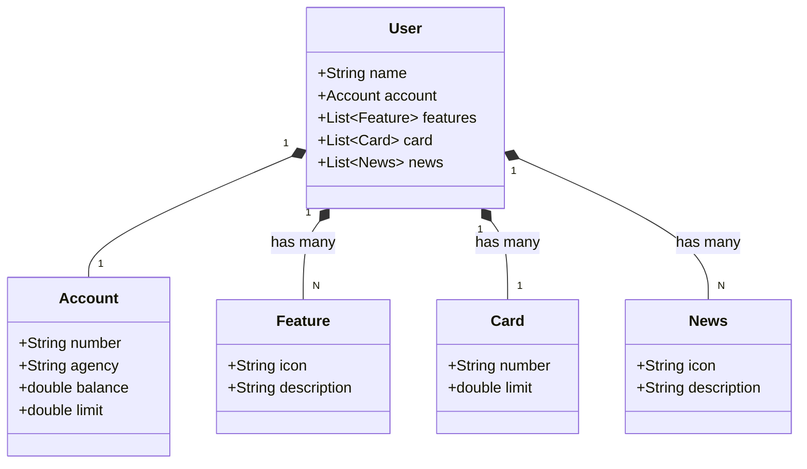
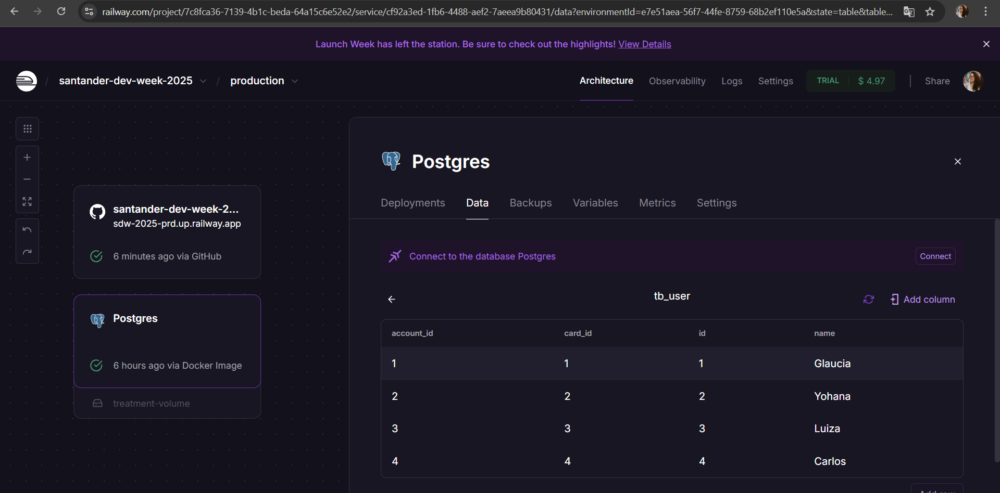
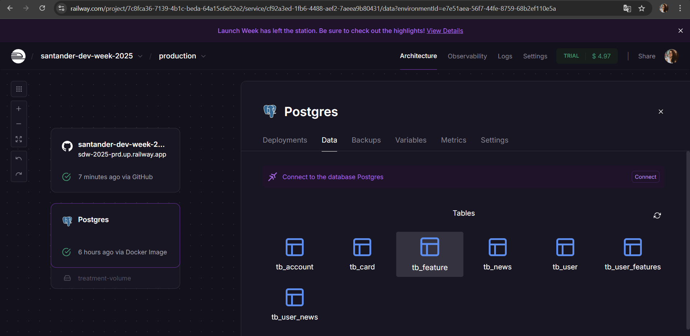
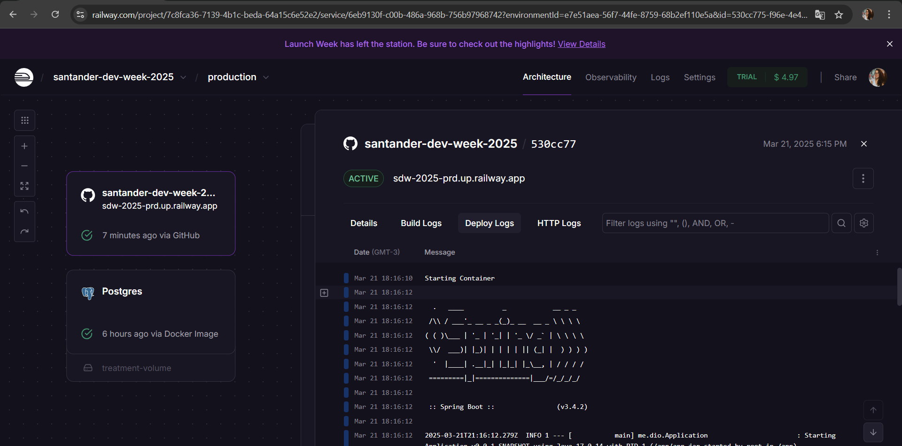
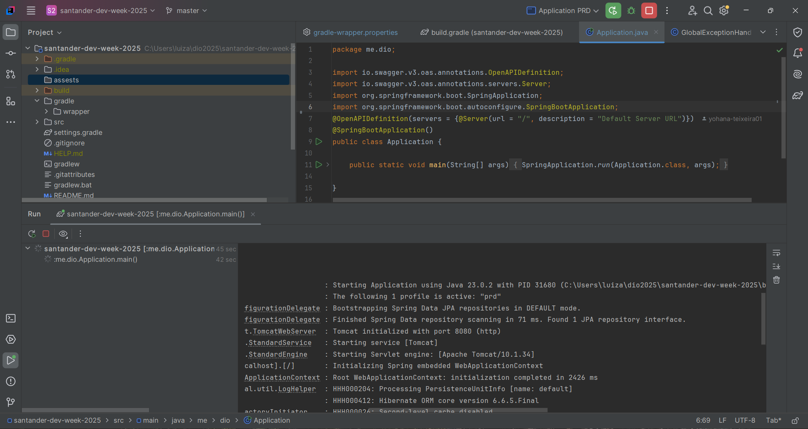
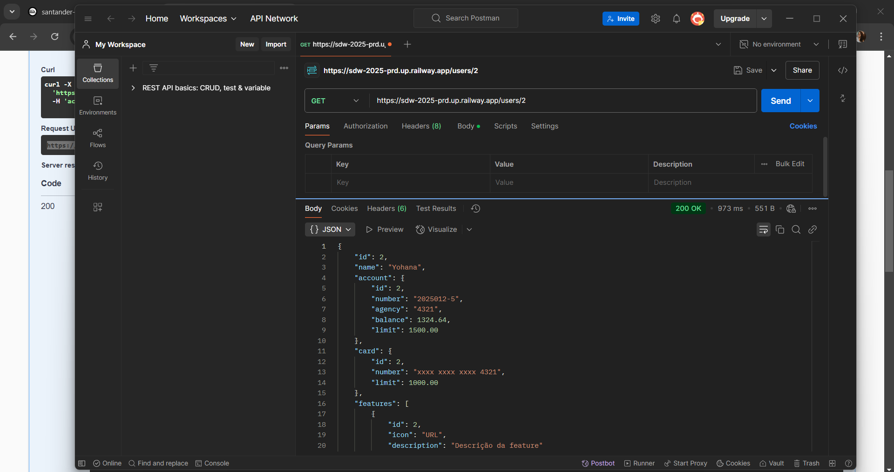
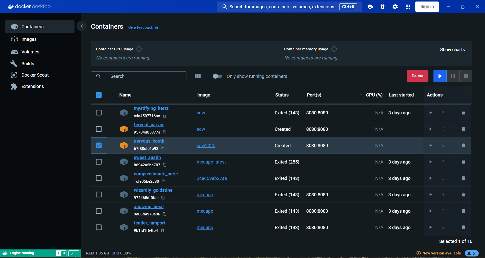

# 🚀 Santander Dev Week 2025 - Java RESTful API  

## 🎯 Objetivo do Projeto 
Criar uma API REST utilizando **Java 17** e **Spring Boot 3**, seguindo boas práticas de desenvolvimento e deploy na nuvem com **Railway**.  

## 🛠️ Tecnologias Utilizadas  

As principais tecnologias e ferramentas utilizadas neste projeto são:  

    
    
    
    
    

  

## Diagrama de Classes

## 📋 Estrutura do Projeto  

### 🔹 **Camadas do Backend**  

- **Model:** Define as entidades do banco de dados, incluindo **User**, **Account**, **Card**, **Feature** e **News**.  
- **DTO (Data Transfer Object):** Organiza e encapsula os dados enviados e recebidos.  
- **Repository:** Interface JPA para operações com o banco de dados.  
- **Service:** Contém a lógica de negócios e métodos CRUD.  
- **Controller:** Define os endpoints REST para manipulação dos dados.  

### 🔹 **Banco de Dados**  

O sistema gerencia as seguintes entidades:  

- **User**: Representa um usuário e suas informações associadas.  
- **Account**: Contém dados da conta bancária, como número, agência, saldo e limite.  
- **Card**: Representa um cartão de crédito com número e limite disponível.  
- **Feature**: Funcionalidades disponíveis para o usuário.  
- **News**: Notícias associadas ao usuário.  

### 🔹 **Operações CRUD**  

- **Create:** Criar usuários e os outros.  
- **Read:** Busca usuários por ID e lista.  
- **Update:** Atualiza informações do usuário.  
- **Delete:** Exclui um usuário e/ou o número do cartão do sistema.  

### 🔹 **Outras Implementações Presentes*  

✅ **Tratamento de Exceções:**  
  - Implementação de um **GlobalExceptionHandler** para capturar erros comuns como `NoSuchElementException` e `IllegalArgumentException`, retornando respostas amigáveis.  

✅ **Docker e Railway:**  
  - **Docker:** Configuração via `Dockerfile` para facilitar a execução do projeto em qualquer ambiente.  
  - **Railway:** Deploy automatizado, tornando a API acessível online.  

---
## ⚠️ Problema Conhecido com Swagger  

Durante o desenvolvimento, foi identificado um problema com a versão **2.1.0 do Swagger** ao utilizar @RestControllerAdvice para tratar os erros mostrando **Failed to load API definition**.

**Solução:**
A migração para a versão **2.8.4 do Springfox** resolveu esse problema. Além disso, foi necessário forçar o exemplo de campos do tipo `Long` utilizando a anotação `@Schema(example = "0")`, porque ao gerar exemplos para campos do tipo **Long**. O Swagger UI exibia um ID absurdo (9007199254740991), que é o limite máximo de segurança do JavaScript, devido a um bug conhecido nas versões antigas do Springfox. E essa solução corrigiu a exibição errada do ID.
Se você enfrentar o mesmo problema ao utilizar o @RestControllerAdvice, confira a solução completa no link do StackOverflow abaixo:

[Problema com Versão do Swagger 2.1.0 e solução](https://stackoverflow.com/questions/79274106/how-to-use-both-restcontrolleradvice-and-swagger-ui-in-spring-boot)

## 📂 Imagens do Projeto  

As imagens do funcionamento do projeto estão disponíveis abaixo:  

   
  
    
    
      
    
      

