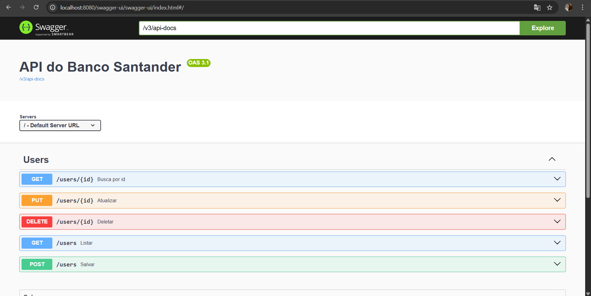

# 🚀 Santander Dev Week 2025 - Java RESTful API  

## 🎯 Objetivo do Projeto 
Criar uma API REST utilizando **Java 17** e **Spring Boot 3**, seguindo boas práticas de desenvolvimento e deploy na nuvem com **Railway**.  

## 🛠️ Tecnologias Utilizadas  

As principais tecnologias e ferramentas utilizadas neste projeto são:  

    
    
    
    
    

  

## Diagrama de Classes

## 📋 Estrutura do Projeto  

### 🔹 **Camadas do Backend**  

- **Model:** Define as entidades do banco de dados, incluindo **User**, **Account**, **Card**, **Feature** e **News**.  
- **DTO (Data Transfer Object):** Organiza e encapsula os dados enviados e recebidos.  
- **Repository:** Interface JPA para operações com o banco de dados.  
- **Service:** Contém a lógica de negócios e métodos CRUD.  
- **Controller:** Define os endpoints REST para manipulação dos dados.  

### 🔹 **Banco de Dados**  

O sistema gerencia as seguintes entidades:  

- **User**: Representa um usuário e suas informações associadas.  
- **Account**: Contém dados da conta bancária, como número, agência, saldo e limite.  
- **Card**: Representa um cartão de crédito com número e limite disponível.  
- **Feature**: Funcionalidades disponíveis para o usuário.  
- **News**: Notícias associadas ao usuário.  

### 🔹 **Operações CRUD**  

- **Create:** Criar usuários e os outros.  
- **Read:** Busca usuários por ID e lista.  
- **Update:** Atualiza informações do usuário.  
- **Delete:** Exclui um usuário e/ou o número do cartão do sistema.  

### 🔹 **Outras Implementações Presentes*  

✅ **Tratamento de Exceções:**  
  - Implementação de um **GlobalExceptionHandler** para capturar erros comuns como `NoSuchElementException` e `IllegalArgumentException`, retornando respostas amigáveis.  

✅ **Docker e Railway:**  
  - **Docker:** Configuração via `Dockerfile` para facilitar a execução do projeto em qualquer ambiente.  
  - **Railway:** Deploy automatizado, tornando a API acessível online.  

---

## 📂 Imagens do Projeto  

As imagens do funcionamento do projeto estão disponíveis abaixo:  

   
  
    
    
      
    
      

